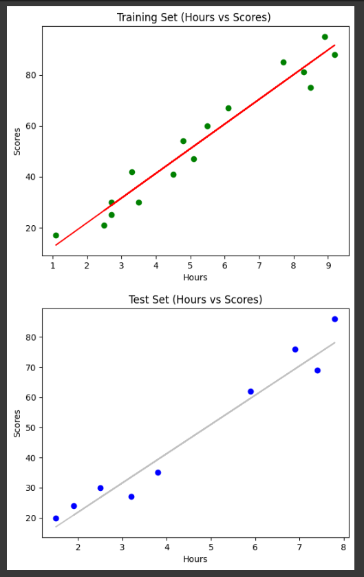

# Implementation-of-Simple-Linear-Regression-Model-for-Predicting-the-Marks-Scored

## AIM:
To write a program to predict the marks scored by a student using the simple linear regression model.

## Equipments Required:
1. Hardware – PCs
2. Anaconda – Python 3.7 Installation / Jupyter notebook

## Algorithm
1. Read the given CSV file.
2. Import the necessary libraries.
3. Split the values for training and testing.
4. Implement Linear Regression
5. Plot the regression line.
6. Calculate the error.

## Program:
```python

# Program to implement the simple linear regression model for predicting the marks scored.
# Developed by: Sam Israel D
# RegisterNumber:  212222230128
```
#### Reading the CSV file.
```python
import pandas as pd
df = pd.read_csv("/content/student_scores.csv")
print(df.head())
print(df.tail())
print(df.info())
```
#### Importing the necessary libraries.
```python
import numpy as np
from sklearn.metrics import mean_absolute_error, mean_squared_error
import matplotlib.pyplot as plt
from numpy.random import random_sample
from sklearn.model_selection import train_test_split
```
#### Assigning the values to X and Y.
```python
X = df.iloc[:,:-1].values
Y = df.iloc[:,-1].values
```
#### Splitting the values for testing and training.
```python
X_train, X_test, Y_train, Y_test = train_test_split(X,Y,test_size=1/3,random_state=0)
print('X_train= ',X_train,'\n',"X_test= ",X_test,'\n',"Y_train= ",Y_train,'\n',"Y_test= ",Y_test)
```
#### Implementing Linear Regression.
```python
from sklearn.linear_model import LinearRegression
reg = LinearRegression()
reg.fit(X_train,Y_train)
Y_pred = reg.predict(X_test)
print(Y_pred)
print(Y_test)
```
#### Plotting of the regression line.
```python
plt.scatter(X_train,Y_train,color="green")
plt.plot(X_train,reg.predict(X_train),color="red")
plt.title("Training Set (Hours vs Scores) ")
plt.xlabel("Hours")
plt.ylabel("Scores")
plt.show()
plt.scatter(X_test,Y_test,color="blue")
plt.plot(X_test,reg.predict(X_test),color="silver")
plt.title("Test Set (Hours vs Scores)")
plt.xlabel("Hours")
plt.ylabel("Scores")
plt.show()
```
#### Calculation of error.
```python
mse = mean_squared_error(Y_test,Y_pred)
print("MSE = ",mse)
mae = mean_absolute_error(Y_test,Y_pred)
print("MAE = ",mae)
rmse = np.sqrt(mse)
print("RMSE = ",rmse)
```
#### Checking the working of the created model.
```python
a = np.array([[10.0605532]])

Y_pred1 = reg.predict(a)
Y_pred1
```
## Output:





## Result:
Thus, the program to implement the simple linear regression model for predicting the marks scored is written and verified using python programming.
